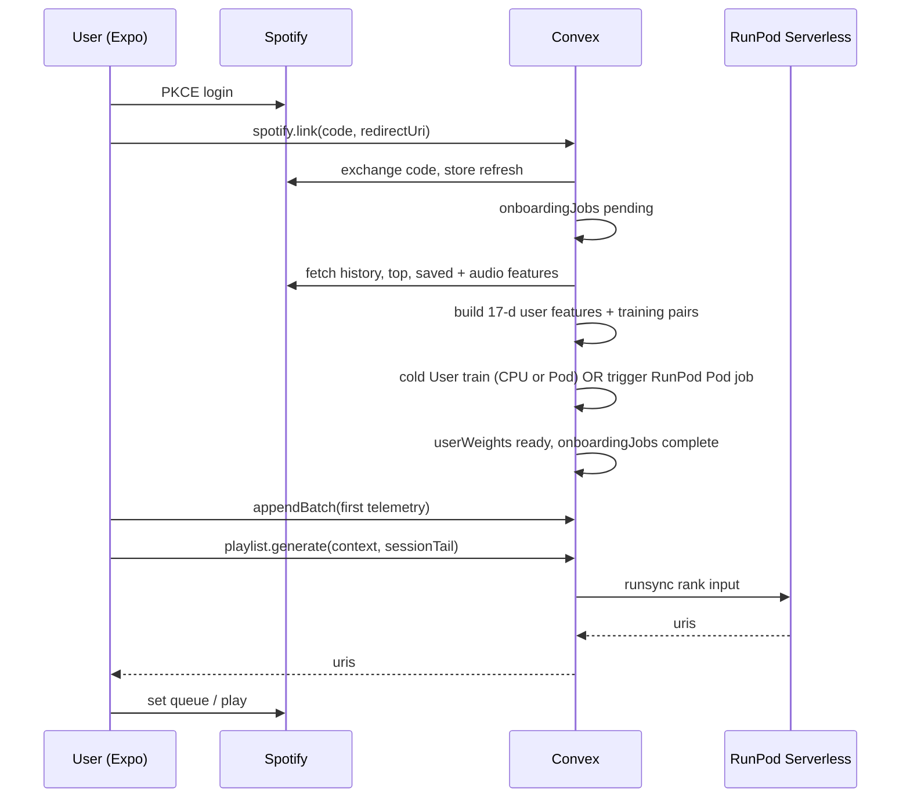

# Attune — product flows, data, onboarding, and how models improve

Architecture numbers: [`ml/README.md`](../ml/README.md). Stack: [`decisions/0001-stack.md`](decisions/0001-stack.md).

---

## 1. Research grounding (why this design)

**Two-tower + metadata** — Industry pattern: one encoder for **user** context, one for **items** (here: Song Tower on audio/tabular features). NVIDIA Merlin describes two-tower models as strong for **retrieval + cold start** when item/user sides have rich features ([two-tower article](https://medium.com/nvidia-merlin/solving-the-cold-start-problem-using-two-tower-neural-networks-for-nvidias-e-mail-recommender-2d5b30a071a4)). Academic work on **item cold-start** in two-tower systems stresses **balancing side information with interactions** (e.g. [IEEE Access — flexible two-tower item cold-start](https://ieeeaccess.ieee.org/featured-articles/flexible2-towermodel/)).

**Sequential playlists** — Music sessions are **ordered**; RNNs for skip/session modeling ([arXiv:1904.10273](https://arxiv.org/abs/1904.10273)) and **Transformers / SASRec-style** session models are standard for playlist continuation ([RecSys workshop paper PDF](https://ceur-ws.org/Vol-4045/paper2.pdf)). Spotify Research’s **CoSeRNN** highlights **session sequences + context** (time of day, device) for contextual recommendations ([Spotify Research — CoSeRNN](https://research.atspotify.com/contextual-and-sequential-user-embeddings-for-music-recommendation)).

**Online / incremental learning** — Naive fine-tune-only-on-new-data causes **catastrophic forgetting**. Practice: **replay buffers** + selective replay / distillation (e.g. exemplar replay line of work in incremental recommenders — [AAAI INFER](https://ojs.aaai.org/index.php/AAAI/article/view/28790), [Personalized Negative Reservoir arXiv:2403.03993](https://arxiv.org/abs/2403.03993)). Attune’s **200-event replay + small batch updates** matches this family at hackathon scale.

**Takeaway for Attune:** keep **Song Tower frozen** (global geometry), **User Tower plastic** (per-user + online), **Context** as a **gate** on how much situation shifts the user vector, **GRU** for **session coherence** once you have session logs — aligns with both product goals and literature.

---

## 2. App functionality (specific, by surface)

All platforms share: **Convex sync**, same **event schema**, **“Generate for now”** entry point. Differences are **playback SDK** and **permissions**.

### 2.1 iOS & Android (Expo native)

| Feature | Behavior |
|---------|----------|
| **Sign in with Spotify** | PKCE in app → send `code` to Convex → refresh token **B** stored server-side only ([scopes](https://developer.spotify.com/documentation/web-api/concepts/scopes)). |
| **Playback** | Spotify **Remote / app-remote-control** path; Attune does not re-stream files. |
| **Now playing strip** | Title, artist, **listen progress** ring, skip / previous, **volume** (if OS exposes changes). |
| **“Attune this moment”** | One tap: read **local hour + weekday**, **coarse location bucket** (user-tunable: home / gym / transit / other), **last weather snapshot**, **current session tail** → Convex `playlist.generate` → receive **~20 URIs** → enqueue via Spotify queue API. |
| **Telemetry loop** | On **track change**, **periodic progress** (e.g. every 5–15 s while playing), **pause**, **seek**, **skip** (<5 s, 5–30 s, >30 s buckets), **replay**, **add to library** if you request `user-library-read` — emit **batched** `playbackEvents` with **idempotency key**. |
| **Onboarding wizard** | Steps in §4 — **permission prompts** for location (When-In-Use) and optional **motion** later. |
| **Explainability (v1)** | Short string: “More familiar because you’re at the gym” / “Pushed tempo up after skips” — rule + model metadata, not full SHAP. |

### 2.2 Web (Expo web)

| Feature | Behavior |
|---------|----------|
| **Sign in** | Same PKCE; redirect URIs must match **Spotify dashboard** + hosting domain. |
| **Playback** | [Web Playback SDK](https://developer.spotify.com/documentation/web-playback-sdk) + **`streaming`** scope (**Premium** required per Spotify). |
| **Telemetry** | Same events; **volume** may be limited — if unavailable, **omit** feature or send `null` and let model use other signals ([`ml/README.md`](../ml/README.md) weather ramp). |
| **Location / weather** | Browser geolocation (prompt) or **manual city**; weather via **Convex action** (hide API key) preferred. |

### 2.3 Settings (all)

- **Unlink Spotify** — revoke refresh in Convex + delete weights row + replay buffer pointer.
- **Data** — link to privacy text; **export** optional post-hackathon.

---

## 3. Gathering data (what, when, how)

### 3.1 Implicit feedback (always on after consent)

| Signal | Source | Frequency / trigger | Stored fields (conceptual) |
|--------|--------|----------------------|------------------------------|
| **Progress** | SDK position | Every **5–15 s** while playing + on pause/stop | `position_ms`, `duration_ms`, `listen_ratio` |
| **Skip depth** | User skip | Immediate | `skip_bucket`: instant / early / late |
| **Replay** | User restarts same track | Event | `replay: true` |
| **Volume delta** | System volume | On meaningful change | `volume_delta` normalized |
| **Session aggregates** | Client compute or server | Each event | `session_skip_rate`, `consecutive_skips` |
| **Explicit** | Like / add to playlist | On action | requires extra scopes |

### 3.2 Context snapshot (attach to each batch or playlist request)

| Field | Source |
|-------|--------|
| **Time** | Device local `hour_local`, `dow` |
| **Location bucket** | GPS → coarse bucket **or** user override |
| **Weather** | Open-Meteo / OpenWeather via Convex action → `temp`, `condition`, `humidity`, `is_day` |
| **`weather_feature_enabled`** | Convex: **false** until **≥21 days** since first event **or** enough rain/weather diversity (per `ml/README`) |

### 3.3 Spotify API pulls (server-side, Convex with refresh **B**)

Minimal set for **cold User Tower** + **known pool** for interleaving:

| Data | Scope (see [Spotify scopes](https://developer.spotify.com/documentation/web-api/concepts/scopes)) | Used for |
|------|--------------------------------------------------------------------------------------------------------|----------|
| Recently played | `user-read-recently-played` | Short-term taste + recency weights |
| Top artists / tracks | `user-top-read` | Medium-term taste |
| Saved tracks | `user-library-read` | **Known** pool for interleave |
| Audio features per track | Implicit via track IDs + [audio features endpoint](https://developer.spotify.com/documentation/web-api/reference/get-audio-features) | User aggregate features + consistency with Song Tower |

**Rate limits:** batch Spotify fetches in onboarding; **cache** `audio_features` by `track_id` in Convex or KV to avoid duplicate calls.

---

## 4. Onboarding — sequence to first recommendation

**Goal:** after **<15 minutes wall** (mostly network + one CPU/GPU job), user gets a **first “Attune this moment”** playlist that is already better than random because **User Tower** was fit on their history; **GRU** may still be stub or generic until sessions exist.

### Step-by-step (product copy can mirror this)

1. **Welcome** — value prop: “Playlists for *this* moment; improves when you skip or stay.”
2. **Spotify connect** — OAuth; success → Convex `spotify.link`.
3. **Permissions** — location (for bucket), optional notifications for “session summary.”
4. **Background: Convex** — pull **recently played** (last ~50), **top tracks** (medium_term), **saved sample** (cap N); fetch **audio features** for those track IDs; build **User Tower** training set (positives = high play / saved; negatives = random non-interacted from global catalog sample).
5. **Cold train** — run **User Tower** (minutes on CPU or GPU Pod per compute plan); persist **~212 KB** weights to `userWeights`.
6. **“You’re ready”** — enable **Attune this moment** button.
7. **First play** — user starts any Spotify playback from Attune; app begins **event stream**; first **playlist.generate** uses **User + Context** (weather maybe off) + **FAISS** + **GRU stub or generic** until session data exists.

**If history is sparse** (new Spotify account): fall back to **genre/top-artist**-biased candidate pool from global FAISS + higher **known** fraction in interleave until events accumulate.

---

## 5. How the model improves itself (continuously)

Five **loops**, ordered by how often they run:

### 5.1 Online User Tower (every meaningful playback event)

- After each labeled event (see [`ml/README.md`](../ml/README.md) label table): **one** optimizer step on **User Tower only**, Song embedding **frozen**, **learning rate ~1e-5**, **grad clip 0.3**, batch = **new event + 8 replayed** from buffer (~200) — mitigates **forgetting** (cf. incremental recommender / replay literature above).
- **Where it runs:** Convex action → **RunPod Serverless** `online_step` (or batched every N seconds if you throttle cost).

### 5.2 Context Encoder (slow drift)

- **Retrain** when you have enough **(context, outcome)** pairs — e.g. weekly job or after **10k** new events org-wide for hackathon skip.
- **Gate** learns how much weather/time should move the user vector; **ramps** weather weights after enough **rain + behavior** samples.

### 5.3 GRU sequencer (session coherence)

- **Retrain offline** when you have **1–2 weeks** of **session-ordered** events (or synthetic pre-data for demo).
- Improves **next-track** under same context vs User-only dot product.

### 5.4 Exploration in the **policy** layer (not always more model)

- **Known / new mix** shifts from **skip rate** and **replay rate** ([`ml/README.md`](../ml/README.md) interleave rules) — this is **contextual bandit–like** exploration without training a second bandit head for v1.

### 5.5 Periodic full refresh (optional post-hackathon)

- Nightly **re-embed** new catalog tracks through **Song Tower** (frozen weights) + **FAISS incremental add** for new `track_id`s.
- Weekly **User cold re-init** from scratch is usually **not** needed if online learning is healthy; use **evaluation** (held-out replay NDCG) to decide.

---

## 6. Evaluation hooks (so “improvement” is measurable)

| Metric | How |
|--------|-----|
| **Skip rate** after Attune playlist starts | A/B or before/after per user |
| **Listen ratio** distribution | Shift toward >0.8 |
| **Retrieval@K** (offline) | Held-out track id prediction from FAISS + User |
| **Session transition loss** (offline) | GRU val loss |

Log these in `ml/evaluation/` as you implement ([implementation plan](superpowers/plans/2026-05-09-attune-implementation-plan.md) Task 5+).

---

## 7. References (short bibliography)

- Two-tower / cold-start: [NVIDIA Merlin — two-tower](https://medium.com/nvidia-merlin/solving-the-cold-start-problem-using-two-tower-neural-networks-for-nvidias-e-mail-recommender-2d5b30a071a4), [IEEE Access flexible two-tower item cold-start](https://ieeeaccess.ieee.org/featured-articles/flexible2-towermodel/)
- Session / playlist: [arXiv:1904.10273 — RNN session skip](https://arxiv.org/abs/1904.10273), [CEUR playlist continuation PDF](https://ceur-ws.org/Vol-4045/paper2.pdf), [Spotify — CoSeRNN](https://research.atspotify.com/contextual-and-sequential-user-embeddings-for-music-recommendation)
- Incremental / replay: [AAAI INFER](https://ojs.aaai.org/index.php/AAAI/article/view/28790), [arXiv:2403.03993](https://arxiv.org/abs/2403.03993)
- Spotify: [Scopes](https://developer.spotify.com/documentation/web-api/concepts/scopes), [Web Playback SDK](https://developer.spotify.com/documentation/web-playback-sdk)
